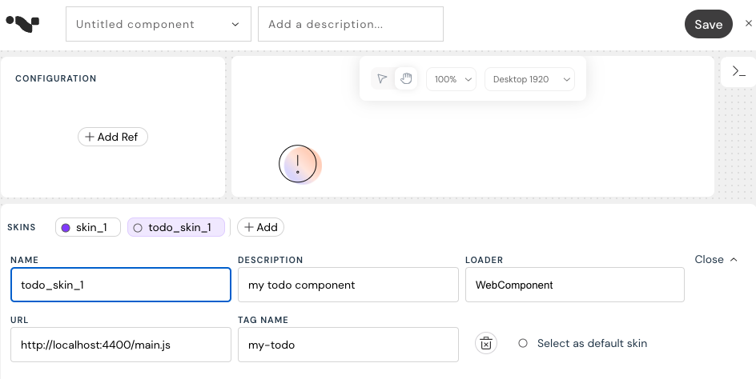

# Myop Angular Integration Guide

## Overview
This guide explains how to integrate your Angular components with Myop, allowing you to expose them as web components and incorporate them into Myop flows.

## Table of Contents
- [Exposing Angular Components](#exposing-angular-components)
- [Creating Myop WebComponents](#creating-myop-webcomponents)
- [Creating Flows](#creating-flows)
- [Using Myop Components in Angular](#using-myop-components-in-angular)
- [Communication with Angular Components](#communication-with-angular-components)

## Exposing Angular Components

There are two ways to expose your Angular components to Myop:

### Direct Exposure
Use the `expose` function to directly expose your Angular component:

```typescript
import {appConfig} from './app/app.config';
import {AppComponent} from './app/app.component';
import {exposeAngularComponent} from "@myop/angular-remote";

exposeAngularComponent(AppComponent, 'test-comp-1', async () => {
   return appConfig
}).then();
```

## Creating Myop WebComponents

Follow these steps to create a Myop WebComponent from your Angular component:

1. Open the Myop dashboard at [https://dashboard.myop.dev/](https://dashboard.myop.dev/)  <br>
   <br>

2. Navigate to the Component Editor screen and click on **"+ Add a Component"** button  <br>
   <br>

3. In the Component Editor, click on **"+ Add"** button

4. Configure your component:
    - Change the loader to "WebComponent"
    - Enter your component URL (e.g., http://localhost:4400/main.js)
    - Enter the tag name that you exposed the component with

5. Your Angular component should now appear in the admin panel

6. Note: The GUID in the browser URL is the `componentId` that you'll need later

## Creating Flows

1. Open the Myop dashboard at [https://dashboard.myop.dev/](https://dashboard.myop.dev/)

2. Navigate to the Flows Editor screen and click on **"+ Add a Flow"** button

3. Add your component to the flow

4. Note: The GUID in the browser URL is the `flowId` that you'll need later

## Using Myop Components in Angular

You can integrate Myop components into your Angular application in two ways:

### Option 1: Via Routing

```typescript
// Before
import { TodoComponent } from './todo.component.ts';

{ path: 'todo', component: TodoComponent }

// After
import { MyopContainerComponent } from '@myop/angular';

{
    path: 'todo',
    data: {
      componentId: "ca8c0c4f-d26e-40c8-bf32-19eb104ee710",
      flowId: "1d75e2f9-9a2d-49f1-aeeb-6268921a29fe"
    },
    component: MyopContainerComponent
}
```

### Option 2: As a Component in Templates

```typescript
// Before
import { Component } from '@angular/core';
import { RouterOutlet } from '@angular/router';
import { TranslocoRootModule } from './transloco-root.module';
import { TodoComponent } from './todo.component.ts';

@Component({
   selector: 'app-root',
   imports: [TodoComponent],
   template: '<todo-component></todo-component>',
})
export class AppComponent {
 
}

// After
import { Component } from '@angular/core';
import { RouterOutlet } from '@angular/router';
import { TranslocoRootModule } from './transloco-root.module';
import { MyopContainerComponent } from '@myop/angular';

@Component({
   selector: 'app-root',
   imports: [MyopContainerComponent],
   template: `<myop-container
                  flowId="1d75e2f9-9a2d-49f1-aeeb-6268921a29fe"
                  componentId="4df90a03-553c-44a3-b153-d0ddccdc0010"/>`
})
export class AppComponent {

}
```

## Communication with Angular Components

The `MyopContainer` component accepts `inputs`, which can include a wide variety of data types. This may consist of simple primitive values, complex objects, functions, and even non-serializable objects.

The `MyopContainer` component also provides a `componentReady` event that you can use to communicate with your Angular component.

```html
<myop-container
   flowId="1d75e2f9-9a2d-49f1-aeeb-6268921a29fe"
   componentId="4df90a03-553c-44a3-b153-d0ddccdc0010"
   [inputs]="someObject"
   (componentReady)="onReady($event)"
 />
```
In your component class
```typescript

someObject = {
   key1: '123',
   key2: '456',
   someInputValue : 'testValue',
   fun1 : ()=>{
      alert('ffff')
   }
}

onReady(component: IMyopComponent) {
    // Send messages to the component
    component.send(ChangeTextMessage.create(component.refs.title, this.inputs.name));
    
    // Show the component
    component.show();
}
```

## Additional Resources

- For more information on the Myop platform, visit [https://myop.dev/](https://myop.dev/)
- For API documentation, refer to [https://docs.myop.dev/](https://docs.myop.dev/)
